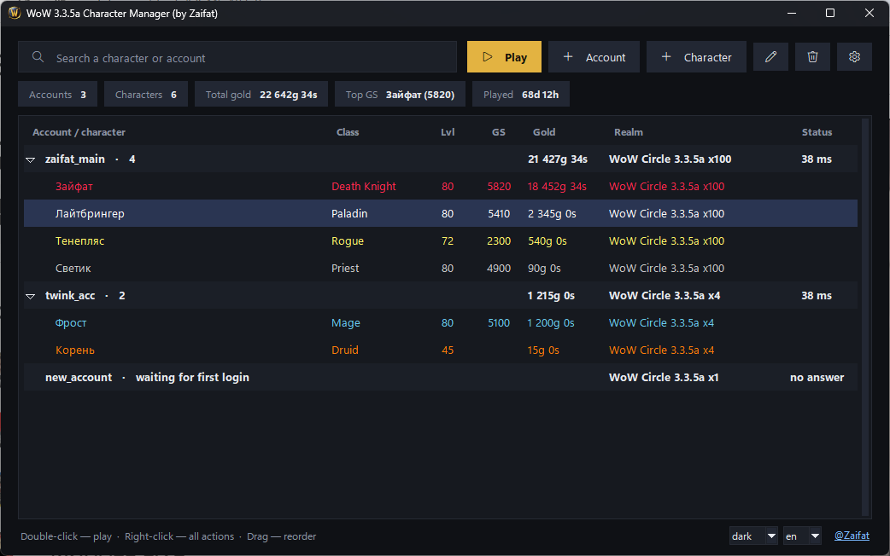

# WoW 3.3.5a Character Manager

**English** · [Русский](README.ru.md)

One-click login for World of Warcraft 3.3.5a (WotLK). Pick a character — the client enters your login, password and 2FA code, selects the realm and walks into the world by itself.



## Features

- **One-click login** — login, password, realm, character and 2FA code, all automatic
- **Accounts with their characters** — add an account once; its characters are picked up on the first login
- **Switch characters without restarting** — from the in-game window or the minimap button (`/wm`)
- **Your whole roster at a glance** — race and class icons, gold, GS, level, weekly dailies, arena games, raid lockouts, professions
- **Group finder** — raid ads from chat sorted by raid, size, roles and GS; one click to whisper (`/wm lfg`)
- **Shared friends & ignore list** — edit it in the manager; every character gets the same list
- **Client tweaks** — 4 GB patch and graphics presets you build yourself
- **Collect everything at once** — the manager walks every account and character and fills the table in
- **2FA** — Google Authenticator, 2FAS, Yandex Key
- **Passwords encrypted** — with the Windows key, or a master password for a portable config
- **Tools** — desktop shortcuts, guild-forum roster export, copy UI settings between characters, WTF backups

## Get started

1. Download `Manager_WOW.exe` from [Releases](../../releases) and install it.
2. **Settings** → point it at the folder with `Wow.exe`.
3. **+ Account** → login and password. Double-click the account to log in — its characters appear on their own.

## How it works

The manager patches `Wow.exe` to load `AwesomeWotlkLib.dll` (based on [awesome_wotlk](https://github.com/FrostAtom/awesome_wotlk)). On launch it writes the login details to `autologin.json`; the DLL reads the file, deletes it at once and drives the login screen. A bundled addon collects character data and adds the in-game window.

Works with any 3.3.5a (build 12340) server. WoWCircle is preconfigured.

## Build

Python 3.10+, Visual Studio 2022 (C++), [Inno Setup 6](https://jrsoftware.org/isdl.php):

```bat
build.bat
```

Tests: `python tests/run_all.py`

## License

MIT · [@Zaifat](https://t.me/Zaifat)
