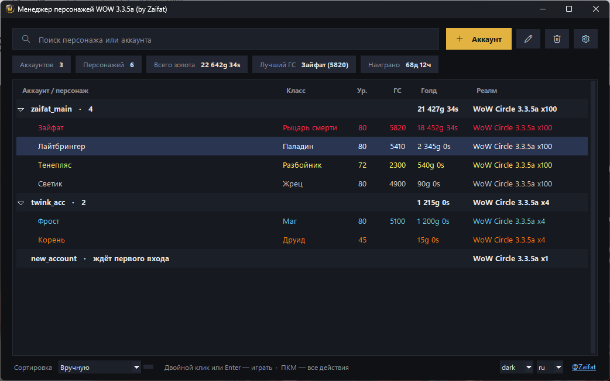

# Менеджер персонажей WoW 3.3.5a

[English](README.md) · **Русский**

Вход в World of Warcraft 3.3.5a (WotLK) в один клик. Выбираешь персонажа — клиент сам вводит логин, пароль и 2FA-код, выбирает реалм и заходит в мир.



## Возможности

- **Вход в один клик** — логин, пароль, реалм, персонаж и 2FA-код подставляются сами
- **Аккаунты с персонажами** — добавляешь аккаунт один раз, персонажи подтягиваются при первом входе
- **Смена персонажа без перезапуска** — из окна в игре или кнопки у миникарты (`/wm`)
- **Все персонажи на одном экране** — золото, ГС, уровень, дейлики, арена за неделю, рейд-локауты, профессии
- **Поиск группы** — объявления о рейдах из чата по рейду, размеру, ролям и ГС; шепнуть в один клик (`/wm lfg`)
- **Общий список друзей и игнора** — добавил друга один раз, он есть на всех персонажах
- **Настройки клиента** — патч «4 ГБ», анти-АФК, свои пресеты графики
- **Сбор данных одной кнопкой** — менеджер сам обойдёт все аккаунты и персонажей и заполнит таблицу
- **2FA** — Google Authenticator, 2FAS, Яндекс.Ключ
- **Пароли зашифрованы** — ключом Windows или мастер-паролем для переносимого конфига
- **Инструменты** — ярлыки на рабочий стол, ростер для форума гильдии, перенос настроек интерфейса между персонажами, бэкапы WTF

## Начало работы

1. Скачай `Manager_WOW.exe` в [Releases](../../releases) и установи.
2. **Настройки** → укажи папку с `Wow.exe`.
3. **+ Аккаунт** → логин и пароль. Двойной клик по аккаунту — вход, персонажи появятся сами.

## Как это работает

Менеджер патчит `Wow.exe`, чтобы тот загружал `AwesomeWotlkLib.dll` (на основе [awesome_wotlk](https://github.com/FrostAtom/awesome_wotlk)). При запуске данные для входа пишутся в `autologin.json`; DLL читает файл, сразу удаляет его и проходит экран входа сама. Встроенный аддон собирает данные персонажей и добавляет окно в игре.

Работает с любым сервером 3.3.5a (build 12340). WoWCircle настроен из коробки.

## Сборка

Python 3.10+, Visual Studio 2022 (C++), [Inno Setup 6](https://jrsoftware.org/isdl.php):

```bat
build.bat
```

Тесты: `python tests/run_all.py`

## Лицензия

MIT · [@Zaifat](https://t.me/Zaifat)
